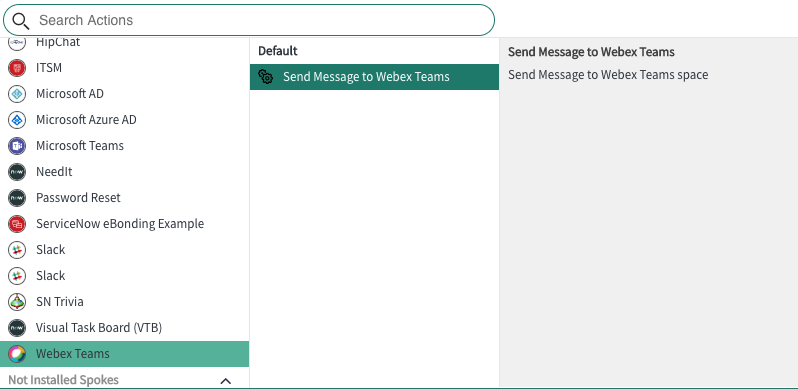

# WebexTeams Spoke

### **Overview**

This repo provides the capability to send a Webex Teams message from a ServiceNow **Workflow** as an **Action**. The Webex Teams icon will be displayed under the **Installed Spokes** in the Action drop down box.

The solution will need a Webex Teams access token to send the message from ServiceNow. In addition, the Webex Teams Room ID is needed to send the message to the correct room/space. 

---

### **Table of Contents**

- [Add ServiceNow app from repo to your Dev instance](https://github.com/pselker2/WebexTeams-spoke/#add-servicenow-app-from-repo-to-your-dev-instance)
- [Create Webex Teams Bot and save the Access Token](https://github.com/pselker2/WebexTeams-spoke/#create-webex-teams-bot)
- [Add Bot to a Webex Teams space](https://github.com/pselker2/WebexTeams-spoke/#add-bot-to-a-webex-teams-space)
- [Get Webex Teams roomId](https://github.com/pselker2/WebexTeams-spoke/#get-webex-teams-roomid)
- [Add Bot Access Token and roomId to ServiceNow app](https://github.com/pselker2/WebexTeams-spoke/#add-bot-access-token-and-roomid-to-servicenow-app)
- [Validate](https://github.com/pselker2/WebexTeams-spoke/#validate)

---

### **Add ServiceNow app from repo to your Dev instance**

1. git clone https://github.com/pselker2/WebexTeams-spoke.git to a public repo like GitHub to enable the ServiceNow Dev instance to access it
2. ServiceNow **Navigator** > Studio
    - A new browser tab opens with the Load Application window
    - Select **Import From Source Control**
    - Use the information from the **new** repo you cloned in step 1
    - In the left Studio pane you should see files associated with the Webex Teams Spoke app (you may need to select the Webex Teams Spoke app if you don't see the files)
    - **Studio** > Source Control > Create Branch
        - The Branch will capture all your changes
        - Source Control > Commit Changes  to save changes to the new repo 

---

### **Create Webex Teams Bot**

1. Log in on [developer.webex.com](https://https://developer.webex.com) (Sign up if you need an account)
2. Click on **Start Building Apps** button
3. Click on **Create a New App** button
4. Click on **Create a Bot** button
5. Fill in the information and click **Add Bot** button at the bottom of the page
6. Save the "Bot's Access Token" in a safe place

---

### **Add Bot to a Webex Teams space**

1. Create a space for testing the Bot you just created
2. Add your new Bot to the space
    - Click **People** in the header at the top of the space
    - Click **Add people**
    - Type the Bot Username (example@webex.bot)
    
---

### **Get Webex Teams roomId**

1. Log in on [developer.webex.com](https://https://developer.webex.com)
2. Click on **Documentation**
3. Click on **API Reference** on the left side
4. Click on **Teams** on the left side
5. Click on the Get Method url with the Description **List Teams**
6. Click the yellow **Run** button on the right side
    - All the Teams you are in will be listed in the response section
    - Copy the "id" of the Team that contains the space with your Bot
7. Click on **Rooms** on the left side
8. Under **Method** click on the Get url to **List Rooms**
    - On the right under **Query Parameters**
        - Paste the "id" of the Team from step 6 into the **teamId** parameter
        - Click the yellow **Run** button on the right side
        - Copy the "id" of the Room that contains your Bot
9. **Alternatively** you can add the roomid@webex.bot bot to the room and it will send you the roomId in a private message and then remove itself from the room

---

### **Add Bot Access Token and roomId to ServiceNow app**

1. ServiceNow **Navigator** > Connections & Credentials > Credentials 
    - Click **WebexTeam_token**
    - In the API key field add "Bearer NYZ89r..." (The word "Bearer" followed by a space followed by the Bot access token)
    - Click **Update**
2. ServiceNow **Navigator** > Connections & Credentials > Connections 
    - Click **WebexTeams_API**
    - In the Connection alias field select **x_305159_webex_tea.WebexTeams_alias**
    - In the Connection URL field type **https://webexapis.com/**
    - Click **Update**
3. ServiceNow **Studio** Under Actions click **Send Message to Webex Teams** (Pop-up window with Flow Designer opens)
    - In Flow Designer under "Action Outline" click on **Inputs**
    - Make the window large enough so you see "V" at the end of the **roomId_value** line and click the "V"
    - Change the Default value to your roomId you saved in step 8 under "Get Webex Teams roomId".  Or you can leave the Default blank.
    - Click **Save**
    
---

### **Validate**

1. In the **Flow Designer window** click **Test** at the top of the window
    - You will see a pop up window with default values for **MessageToWebexTeams** and **roomId_value**.  You can use the default values or modify them.
    - Click **Run Test**
    - Click **Action has been executed.  To view the action, click here.** in the pop up window
    - In the **Execution Details** tab of the **Flow Designer**, click the **Steps** link in the Action section.
    - Scroll to the bottom of the window and you should see **Status Code = 200**
    - Close the Execution Details tab. Then close the "Test Action" pop up window.
    - In the **Send Message to Webex Teams tab** of the Flow Designer window, click **Publish**.
    - Now you can select Webex Teams from the **Action** drop down in a **Flow**.
    
### WebexTeams Installed Spoke choice in Action drop down

